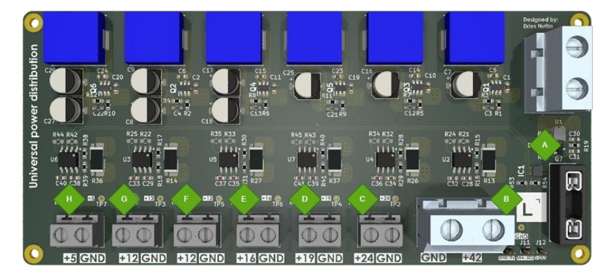

# HARDWARE
This folder contains all hardware-related documentation, schematics, PCB designs, and data collection tools for the autonomous robot system.

# Directory Tree view
This section outlines the structure of the Hardware directory, which contains PCB designs, electrical schematics, component research, data logging utilities, and comprehensive documentation for the robot's power distribution and monitoring systems.

```
├── Data_logging                # Python scripts and Excel files for sensor data collection
├── PCB_research                # Research documentation and testing for PCB components
├── UPD_PCB                     # Universal Power Distribution PCB design files
└── User_Manual-UPD-PCB.pdf     # Comprehensive user manual for the UPD PCB
```
# Universal Power Distribution PCB


Designed and developed by Dries Nuttin

## Introduction

The Universal Power Distribution PCB (UDP-PCB) provides the possibility for quick and easy power distribution in any robotics or electronics project ensuring maximum efficiency. A single battery can provide power to 6 different voltage rails with their respective voltage levels (24V, 19V, 16V, 12V, 12V, 5V). Each stage can supply up to 3.5 Amps continuously with a max voltage input of 60V.

A separate battery output has been provided to allow for a motor driver input equal to the battery voltage, protected by a switchable fuse for easier integration into any project. Each voltage rail (except the battery output) has its own INA219 current/voltage/power sensor that communicates via I²C. The current of the entire system is monitored by an ACS711 HALL sensor which sends out a voltage in relation to the current delivered by the battery. An onboard STS30 digital temperature sensor supplies the user with real-time temperature data to ensure that the PCB/ambient temperature does not reach self-made limits.

### Key Features

- **7 voltage outputs** (BAT+, 24V, 19V, 16V, 12V, 12V, 5V)
- **Single battery input** of 4.3V to 60V max
- **6 different voltages** from 1 battery input
- **±1% voltage level accuracy**
- **3.5 Amps continuous**, with a maximum pulse current of 4.3 Amps
- **Real-time monitoring** of current/voltage/power for 6 voltage rails
- **Real-time HAL current monitoring** of the entire current consumption of the PCB
- **Real-time temperature monitoring**
- **Main system over current fault indicator**
- **Rail supply malfunction indicator**
- **±85% Efficiency** for each buck converter stage
- **BAT+ Fuse protection**
- **Single rail shutdown** that leaves the rest unaffected
- **Over current / temperature protection** on each rail
- **No Over-voltage protection**

> **Note:** V1.0 still has specific repair requirements in place, please consult the repair section of the Hardware/User_Manual-UPD-PCB.pdf to see what needs to be done for newly purchased PCBs.

## Product Specifications

### Absolute Maximum Ratings

| No. | Parameter | Min | Typical | Max | Unit |
|-----|-----------|-----|---------|-----|------|
| 1 | Input voltage (Battery+) | 4.3 | - | 60 | V |
| 2 | Current Battery input (Continuous) |  | 32 |   | A |
| 3 | Current Battery input (1 pulse, 100ms) |   | 100 |   | A |
| 4 | Rail current (Continuous) |   | 3.5 |   | A |
| 5 | Rail current (pulsed, hiccup mode) |   | 6 |   | A |
| 6 | Current usage with no output |   | 54 |   | mA |
| 7 | Thermal shutdown threshold |   | 165 |   | °C |
| 8 | PCB temperature | -40 | 35 | 165 | °C |

> **Warning:** These ratings should not be exceeded, doing so can lead to permanent damage to the PCB or components.

### Pin Configuration


| Label | Function | Description |
|-------|----------|-------------|
| A | Main battery input | 4.2V to 60V |
| B | Fuse | Linked to output E |
| C | ACS711 VIout output | Current sensor output |
| D | I²C output | Sensor communication |
| E | Main battery output | With fuse protection |
| F | 24V output | Regulated 24V rail |
| G | 19V output | Regulated 19V rail |
| H | 16V output | Regulated 16V rail |
| I | 12V_1 output | First 12V rail |
| J | 12V_2 output | Second 12V rail |
| K | 5V output | Regulated 5V rail |

**Color Legend:**
- Red = Power input/output
- Yellow = Sensor output
- Grey = Fuse

### LED Status Indicators



If all LEDs are on = Working as expected

| Label | Function | Meaning if not on |
|-------|----------|-------------------|
| A | Fault for ACS711 HALL current sensor | Overcurrent |
| B | Battery output voltage line | No voltage available |
| C | 24V output voltage line | No voltage available |
| D | 19V output voltage line | No voltage available |
| E | 16V output voltage line | No voltage available |
| F | 12V output voltage line | No voltage available |
| G | 12V output voltage line | No voltage available |
| H | 5V output voltage line | No voltage available |

> **Note:** The described reasons might not be the only reasons that the LED is off. The LED itself might be broken, the voltage might be unstable, a connection might have severed, the LED resistor might have broken. Please test the power supplies with multimeter. If the LED is off, please consult the repair section of the Hardware/User_Manual-UPD-PCB.pdf.

## How to Use

The UPD-PCB can be utilized in any robotics project that is powered by 1 battery. This battery can be plugged into the PCB, which will follow by the indicator LEDs turning on and each stage delivering an output voltage. Screw terminals have been provided for ease of use to attach the necessary voltage lines. The GND is shared between all terminals, meaning you can switch the ground cables between voltage in/outputs even though this is not recommended.

### Integration Checklist

To integrate the UPD-PCB into any robotics project please ensure the following:

- The battery output is correctly plugged into the screw terminal plug on the PCB
- It is recommended to have a battery switch and anti-spark unit before the PCB
- The Fuse is plugged into the PCB if battery output is required
- All LEDs are on
- The output wires have the correct polarity
- If needed, the I²C and VIout connections are plugged into an external MCU unit

### Example Setup


An example of a UPD-PCB plugged in correctly. Note that the LEDs are not on due to the battery being switched off.

As can be seen in the image, the polarity of the wires is ensured and coherent with the silkscreen on the PCB itself. The fuse is in place for, in this specific case, 25A, and the I²C and VIout wires are not connected. If the battery was enabled, the LEDs should light up and the PCB will immediately work without issue.

> **Note:** The sensors do not need to be enabled for the PCB to deliver stable power

> **Warning:** It is not recommended to plug/unplug any wires while the PCB is on. Doing so can result in permanent damage if any of the live wires touch the IC's or a spark is generated.

## Power Delivery

The power delivery for each rail is being supplied by a fine-tuned LMR516x5 buck converter. This buck converter works at 400 kHz (might vary due to the FPM version being utilized in this design). More information can be found in the datasheet of the buck converter itself. Each buck converter has been chosen for its high efficiency, low thermal rise, high power output (3.5A continuous).

### Voltage Setting


The output voltage of each rail is decided using an external resistor. This resistor is visible in the image above where the resistor R3 has a red square surrounding it. If the output voltage needs to be replaced or is not at the desired resistance, please change this resistor.

The desired resistor value can be calculated using this equation. All resistors used are size 0603.

```
Resistor = (Vout - 0.8V) / 0.8V × 10200
```

## Sensor Integration

The UPD-PCB can monitor each individual rail for voltage, current and power usage. This can be done by a single MCU which has to read out 1 I²C bus and read out an ADC voltage signal. By following the steps in this section, you will be able to read out these sensors and use them for any application.


An example of the sensor integration. Here you can see an ESP32 actively reading out both the VIout pin and the I²C line from the entire PCB.

### INA219

All relevant I²C addresses can be found in the table below. These addresses are changeable if the A1 and A0 connections are changed. Please note that the I²C address for the temperature sensor is identical to the 16V line (0x4A), this table below already has the changed I²C address, the change itself can be found in the repair section of the Hardware/User_Manual-UPD-PCB.pdf.

| Voltage | A1 Connection | A0 Connection | I²C Address (Binary) | I²C Address (Hex) |
|---------|---------------|---------------|---------------------|-------------------|
| +24V | GND | GND | 1000000 | 0x40 |
| +19V | GND | +5V | 1000001 | 0x41 |
| +16V | GND | SDA | 1000010 | 0x42 |
| +12V_1 | +5V | GND | 1000100 | 0x44 |
| +12V_2 | +5V | +5V | 1000111 | 0x47 |
| +5V | +5V | SDA | 1000101 | 0x45 |

#### Arduino Code

Programming a MCU to receive INA219 data from the UPD-PCB can be done using the Arduino IDE:

1. Open the Arduino library manager
2. Search for the Adafruit INA219 library and install it
3. With this, one of the examples can be opened and it should be ready to use!
4. Ensure that you are using one of the addresses previously mentioned in order to read out from the correct sensor.


More information regarding the INA219 can be found [here](https://cdn-learn.adafruit.com/downloads/pdf/adafruit-ina219-current-sensor-breakout.pdf).

Example code for selecting the correct address:

```cpp
#include <Wire.h>
#include <Adafruit_INA219.h>

Adafruit_INA219 ina219(0x41); // 0x41 = +19V line

void setup() {
  Serial.begin(9600);
  ina219.begin();
}

void loop() {
  Serial.print("V: "); Serial.print(ina219.getBusVoltage_V());
  Serial.print("V, I: "); Serial.print(ina219.getCurrent_mA());
  Serial.print("mA, P: "); Serial.print(ina219.getPower_mW());
  Serial.println("mW");
  delay(1000);
}
```

### ACS711

The ACS711 is a Hall-effect-based current sensor that outputs an analog voltage proportional to the current passing through the entire system. It can be connected to an MCU's ADC pin to allow for full-system current monitoring.

**Specifications:**
- Output voltage (VIout) at 0A: VCC / 2 = 2.5V
- Sensitivity: ~45 mV per Amp
- Range: 30A

A calculation must be made in the MCU to determine the correct amount of current. Since the baseline for the ACS is half of the supply voltage (5V) and any positive current will simply add 0.045V/A on top of that baseline. If the current goes in reverse (which it should never do) the VIout will go lower.

The following calculation can be made:

```
Current (A) = (Vout - 5V/2) / 0.045V
```

Example code implementation:

```cpp
const int ACS_PIN = 36; // e.g., GPIO36 (ADC1)

void setup() {
  Serial.begin(9600);
}

void loop() {
  int adc = analogRead(ACS_PIN);
  float voltage = adc * 5.0 / 4095.0;
  float current = (voltage - 2.5) / 0.045; // 45mV per Amp
  
  Serial.print("Current: "); Serial.print(current); Serial.println(" A");
  delay(1000);
}
```

> **Note:** The 16V INA219 sensor has the same I²C address as the Temperature sensor before doing any repairs. Ensure that you either follow the steps in the repair section of the Hardware/User_Manual-UPD-PCB.pdf, or don't use the temperature sensor.

> **Best Practice:** The best way to ensure accurate measurement is to read out the 5V line from the INA219 sensor and use that in the calculation for the supply voltage. Replace 5V with the correct voltage measurement.

### STS30

The STS30 is a digital I²C temperature sensor made by Sensirion, known for its high accuracy and reliability. It outputs temperature values in °C directly over the I²C bus.

**Specifications:**
- Communication: I²C
- I²C address: 0x4A
- Accuracy: ±0.2°C
- Range: -40°C to +125°C

To read out the temperature sensor, an Arduino library such as SHT31 can be used to make it easier to read out the temperature sensor.

```cpp
#include <Wire.h>
#include "Adafruit_SHT31.h"

Adafruit_SHT31 sht = Adafruit_SHT31();

void setup() {
  Serial.begin(9600);
}

void loop() {
  float temp = sht.readTemperature();
  if (!isnan(temp)) {
    Serial.print("Temperature: ");
    Serial.print(temp);
    Serial.println(" °C");
  }
  delay(1000);
}
```


### For more information, please refer to the Hardware/User_Manual-UPD-PCB.pdf.