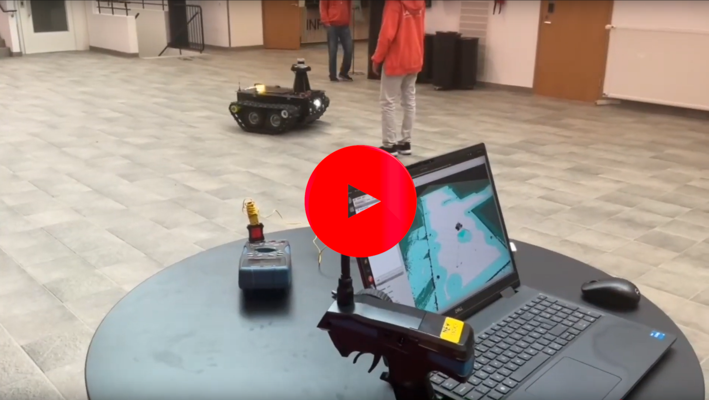

# AI.R-Autonomous_Robot


This is a modular, ROS2‑based platform designed to streamline the development and deployment of autonomous mobile robots. At its core, it leverages ROS2 Navigation 2 for robust path planning and obstacle avoidance, integrates a flexible sensor suite (Lidar, Stereo camera, Thermal camera, GNSS module, ultrasonic array) for reliable perception, and employs Docker containers to ensure reproducible builds. From low‑level firmware on ESP32 microcontrollers to high‑level controls on an NVIDIA Jetson.

## Directory Tree view
This section outlines the main directory structure of the project, separating documents, firmware, hardware designs, and ROS2-based software to keep development organized and modular.
```

├── Documents           # All the Documents and Diagrams
│   ├── MiniATV         # Documents about mini ATV
│   └── Snower          # Documents about Snower
├── Firmware            # All the Firmware programs (for Micro controllers)
├── Hardware            # Universal PCB Design and implementation
├── README.md           # main README file
└── Software            # ROS2 project for Main Brain(Jetson) of the Robots 

```

## System Overview


## ROS2 Transformation Frame Hierarchy

The robot uses a structured TF (transform) tree to manage spatial relationships between all its components, including sensors, base links, and actuators. This hierarchy ensures that data from various sources—like lidar, camera, and GNSS—can be accurately fused and interpreted in a common coordinate space. The TF tree below visualizes how frames are connected and updated in real time during operation.

[](Documents/Snower/tf_tree.pdf)


## Robot Node & Topic Architecture

The ROS2 system is composed of multiple nodes that communicate through a network of topics to handle various tasks like localization, navigation, perception, and control. Each node is modular and focused on a specific function


This diagram, generated with `rqt_graph`, illustrates the live connections between all ROS2 nodes and topics in the Snower. It shows how sensor publishers (e.g., lidar, camera, GNSS, odometry) feed into processing and filtering nodes, how planners and behavior servers interact via action servers/topics, and how control commands flow down to the motor drivers and micro-ROS bridge on the ESP32. By visualizing the full publisher–subscriber and action-server network, you can more verify how each node is wired into the overall autonomy pipeline.


#### In this video, we are testing the autonomous waypoint navigation and dynamic obstacle avoidance capabilities of the Snower 

Click the thumbnail below to watch the demo video:
[](https://youtu.be/Bjw5K9Bklrk?si=DbEx6tLgyb9PHfoj)

