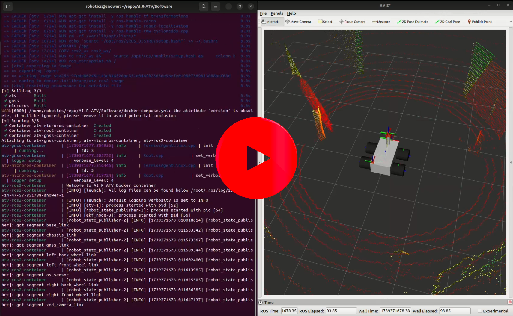
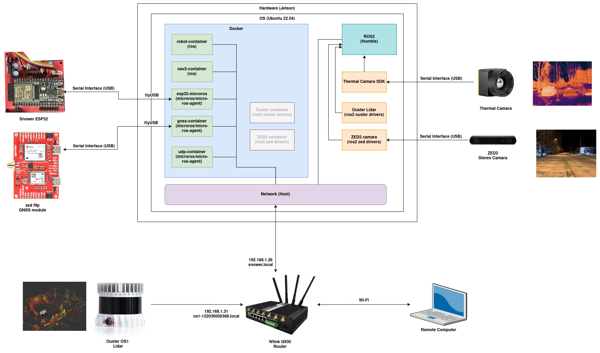

# Software
This folder contains the full ROS 2 workspace and supporting scripts for the main computing unit (Jetson) of the autonomous robot. It includes ROS 2 packages for navigation, sensor data collection, and robot localization, along with configuration files, and systemd services to automate startup. The workspace is organized for use inside a Docker environment for portability and ease of deployment.

## Directory Tree view
This section outlines the structure of the Software directory, which contains all ROS2 packages, Docker configurations, launch scripts, and service files required to run the robot’s main control system inside containers. It helps maintain a modular and reproducible development environment.

```
├── cyclonedds-config.xml        # Configuration for CycloneDDS communication middleware
├── docker-compose.yml           # docker compose configuration file for the robot system
├── Dockerfile                   # Base Dockerfile for building the ROS2 environment
├── microros.Dockerfile          # Dockerfile for building the micro-ROS agent
├── ouster-ros.Dockerfile        # Dockerfile specifically for building the Ouster LiDAR ROS node
├── ros2_ws                      # ROS2 workspace for all core packages
│   └── src                      # ROS2 src directory
│       ├── data_collector       # Package for collect and store sensor data (point cloud, thermal and stereo camera)
│       ├── navigator            # Package for Navigation, localization and Mapping
│       └── robot                # Package for core robot control and state estimation (URDF and odometry)
├── ros_entrypoint.sh            # entrypoint Script for Dockerfile
└── systemctls                   # directory for systemctl services related files
    ├── scripts                  # Shell scripts for .service files
    └── services                 # Systemd .service files
```

## Docker: Build & Run
First You have to install Docker Engine, then you can easily build and run the project. To launch the software program, navigate to the Software directory and execute the following command:

```bash
sudo docker compose build && sudo docker compose up
```
This will build all required images and start the ROS 2 system along with its dependencies.

Click the thumbnail below to watch the demo video:
[](https://youtu.be/bKZ6i2iMwEY?si=wWfmDxZEH7T19WWM)

## Software Architecture




## Warning

> **Warning:**
> If you have a older docker composer version(Compose v1) use **docker-compose** command 
```bash
sudo docker-compose build && sudo docker-compose up
```

<br>

> **Warning:**
> Ensure you are using Docker Engine directly for compatibility and performance reasons. If you use Docker Desktop you might find issues with serial communication. 

eg :-
```
error    | TermiosAgentLinux.cpp | init                     | open device error      | device: /dev/ttyUSB0, errno: 21
Error while starting serial agent!
```
```
Serial port not found. | device: /dev/ttyUSB0, error 2, waiting for connection...
```

> But if you able to solve that issue using Docker Desktop, please let us know by updating this README.md file.